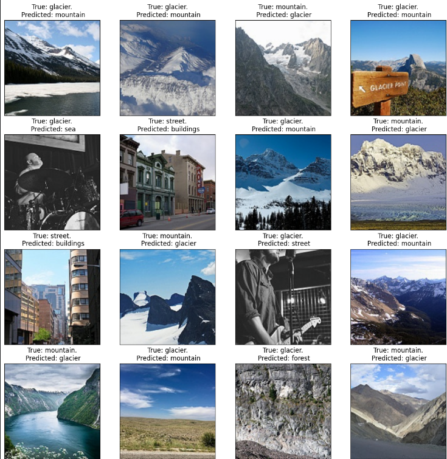

# Intel scene image classification
Using PyTorch image classification models to classify images in the Intel scene dataset.

### How to run
To train the model:
```python train.py```.

To run the gradio application:
```python inference.py```.


Make images same size with rescale_images.py

Figures below illustrate the simple Gradio application that accepts an image, then outputs the top 3 probabilities. 

Gradio application           |  Gradio application in action
:-------------------------------------------:|:-----------------------------------:
  |


## Dataset
The [Intel scene dataset]((https://www.kaggle.com/datasets/puneet6060/intel-image-classification)) consists of 6 classes (mountain, street, glacier, buildings, sea, forest). The original size of the images are 150x150, but are resized to 224x224. As the figure below shows, the dataset is close to being evenly distributed, with approximately 1/6th of the images being in each class.


Dataset distribution (SWAP TO VALIDATION?)                  |  4x4 grid of images from dataset
:-------------------------------------------:|:-----------------------------------:
  |


The following data augmentation techniques were used, with each augmentation technique having 25% chance to be applied. 


## Modelling
Code supports ResNet18-101, with the possibility to add other PyTorch image classification models easily by adding the model and weights under model/model.py, then add them to the model_mapping dictionary. 

Most of the parameters can be changed under config/config.py, such as image size, training from checkpoints, data augmentation and early stopping.


## Results
The best validation loss occurs at epoch 9, with $\text{valid\_loss}=0.1748$, $\text{valid\_accuracy}=0.9784$ and $\text{valid\_f1}=0.9366$. The number of epochs was 30, but early stopping kicked in at epoch 14.

TODO: convert training time to "XmYs" or something like that?

|Epoch|Training time (m)|train_loss|train_accuracy|train_f1|valid_loss|valid_accuracy|valid_f1|
|-----|-----------------|----------|--------------|--------|----------|--------------|--------|
|1    |3.54             |1.2669    |0.8896        |0.6712  |0.5539    |0.9632        |0.8921  |
|2    |2.0              |0.4176    |0.9627        |0.89    |0.2729    |0.9718        |0.9172  |
|3    |2.01             |0.2639    |0.9729        |0.9197  |0.2171    |0.9733        |0.9214  |
|4    |2.0              |0.2172    |0.9758        |0.9287  |0.1977    |0.9748        |0.9255  |
|5    |2.0              |0.1864    |0.9791        |0.9384  |0.1862    |0.9764        |0.9307  |
|6    |2.0              |0.1697    |0.9809        |0.9436  |0.1803    |0.9776        |0.9342  |
|7    |2.02             |0.1534    |0.9826        |0.9488  |0.1791    |0.9777        |0.9342  |
|8    |2.02             |0.1398    |0.984         |0.9529  |0.1793    |0.977         |0.9322  |
|9    |2.01             |0.1287    |0.9851        |0.9562  |0.1748    |0.9784        |0.9366  |
|10   |2.01             |0.1192    |0.9867        |0.9609  |0.1776    |0.9794        |0.9393  |
|11   |2.02             |0.1055    |0.9881        |0.965   |0.1807    |0.9788        |0.9372  |
|12   |2.01             |0.0961    |0.9887        |0.9668  |0.1781    |0.9799        |0.9405  |
|13   |2.01             |0.0921    |0.9892        |0.9682  |0.1868    |0.9778        |0.9342  |
|14   |2.02             |0.0838    |0.9908        |0.9729  |0.1841    |0.979         |0.9379  |


From the confusion matrix, we see that all classes score well, but mountain & glaciers and street & buildings can in some cases be mixed up. From the image in 2nd row and 1st column, we can see that there are some outliers that exist in the dataset. There are also some examples where it is hard to judge if it is a street or building that is the correct label. 

Confusion matrix                  |  4x4 grid of wrongly classified examples
:-------------------------------------------:|:-----------------------------------:
  |


## Future work

&#x2610; Learning rate scheduler

&#x2610; Train from checkpoint

&#x2610; Support Huggingface image classification models

&#x2610; Mixed precision