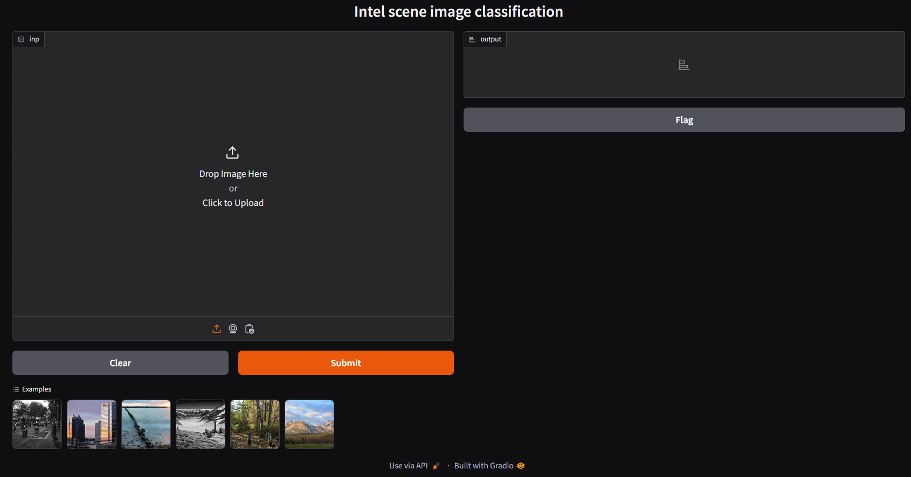
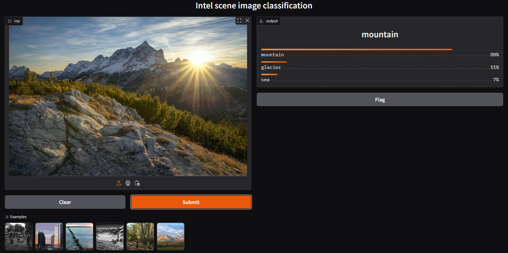
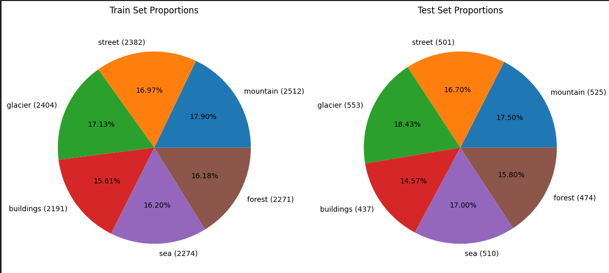
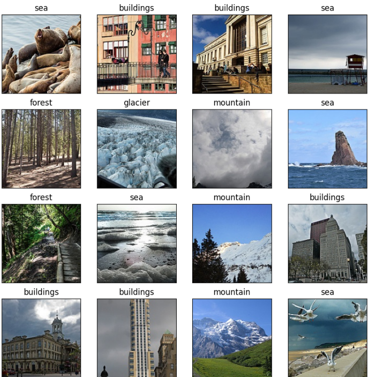
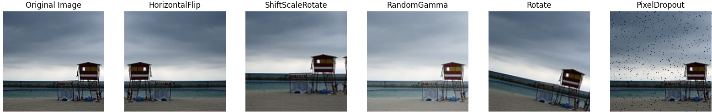
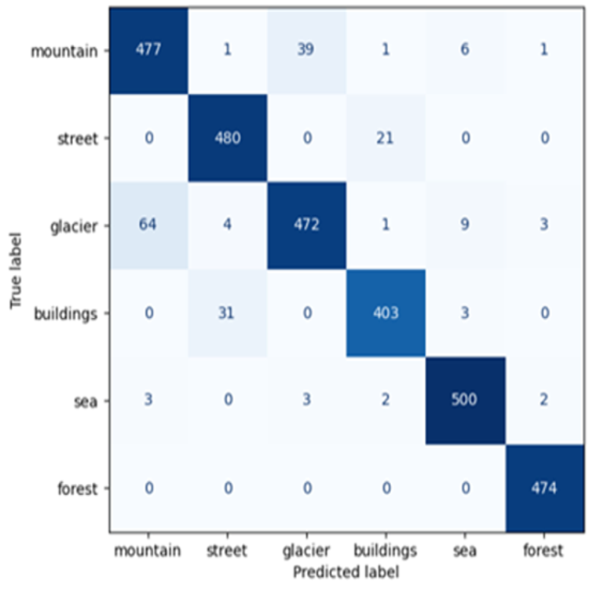

# Intel scene image classification

Using PyTorch image classification models to classify images in the Intel scene dataset.

### How to run
To train the model:
```python train.py```.

To run the gradio application:
```python inference.py```.


Make images same size with rescale_images.py

Figures below illustrate the simple Gradio application that accepts an image, then outputs the top 3 probabilities. 

Gradio application           |  Gradio application in action
:-------------------------------------------:|:-----------------------------------:
  |


## Dataset
The [Intel scene dataset]((https://www.kaggle.com/datasets/puneet6060/intel-image-classification)) consists of 6 classes (mountain, street, glacier, buildings, sea, forest). The original size of the images are 150x150, but are resized to 224x224. As the figure below shows, the dataset is close to being evenly distributed, with approximately 1/6th of the images being in each class.


Dataset distribution                         |  4x4 grid of images from dataset
:-------------------------------------------:|:-----------------------------------:
  |


The following data augmentation techniques were used, with each augmentation technique having 25% chance to be applied. 



## Modelling
Code supports ResNet18-101, with the possibility to add other PyTorch image classification models easily by adding the model and weights under model/model.py, then add them to the model_mapping dictionary. 

Most of the parameters can be changed under config/config.py, such as image size, training from checkpoints, data augmentation and early stopping.


## Results
- insert table of scores

From the confusion matrix, we see that all classes are likely to have the correct class predicted, but mountain & glaciers and street & buildings can in some cases be mixed up.

 # change size of plot? or put table on left side. remove heat map thing


## Future work
https://stackoverflow.com/questions/47344571/how-to-draw-checkbox-or-tick-mark-in-github-markdown-table

&#x2610; Learning rate scheduler

&#x2610; Train from checkpoint

&#x2610; Support Huggingface image classification models